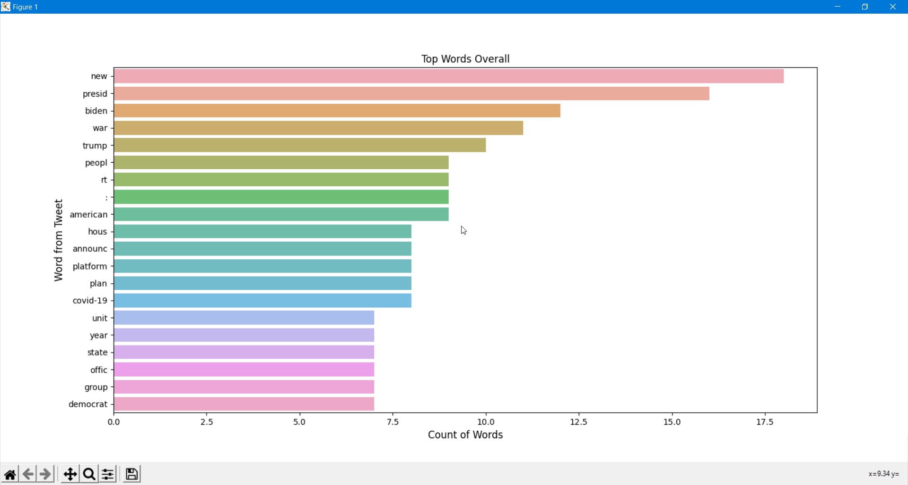

# TWITTER_SENTIMENTAL_ANALYSIS_BY_LEXICON_APPROACH
    
[](https://opensource.org/licenses/MIT)
[](https://www.linkedin.com/in/aaryanmandanapu/)


## Table of Contents

- [Motivation](#motivation)
- [Prerequisites](#Prerequisites)
- [Twitter Developer Account Setup](#Twitter-Developer-Account-Setup)
- [Python Download](#Python-Download)
- [IDE/TextEditor](#IDE/Text-Editor)
- [Install-local](#Install-local)
- [Full workflow to perform sentiment analysis on Twitter data](#Full-workflow-to-perform-sentiment-analysis-on-Twitter-data)
- [Description and purpose of the python files](#Description-and-purpose-of-the-python-files)
    - [Step 1 – Creating Twitter Application](#Step1–Creating-Twitter-Application)
    - [Step 2 - Accessing Twitter Public Data](#Step2-Accessing-Twitter-Public-Data)
    - [Step 3 - Pre-processing](#Step3-Pre-processing)
- [Screenshots](#Screenshots)
- [References](#References)

# Motivation

  As part of my undergraduate thesis, I decided to do a sentiment analysis of twitter. The problem was, I needed a program to scrape Twitter for the data, download it in a mutable format, perform a sentiment analysis, and write to a .csv file which then helps the user to visualize it.

  After searching the internet and github, I couldn't find anything that fit the bill exactly. Sentiment analysis was also another difficult task, until I came across textblob which used the Naive-Bayes classification method which boasts an 80% accuracy rate when applied to social media sentiment analysis.

  I then decided to make it an all-in-one program with a simple-to-use CLI in order to help future researchers.  
   
# Requirements
- Python 3.x
- Spacy module
- PIL
- Word Cloud python module
- NLTK python module
- Tweepy python module
- Seaborn python module
- Matplotlib python module
- Text Blob
- RE (Regular Expression Operations)
- Numpy python module
- Pandas python module

# Prerequisites

# Twitter Developer Account Setup
1) Create a new twitter application and generate your consumer key and access token. https://developer.twitter.com/en/docs/basics/developer-portal/guides/apps.html
https://developer.twitter.com/en/docs/basics/authentication/guides/access-tokens.html
2) Start a new application and fill out your information.
3) Save your needed keys in ([twitter_credentials.py](https://github.com/aaryan778/TWITTER_SENTIMENTAL_ANALYSIS/blob/main/twitter_credentials.py)) file.
  * Consumer ID (API KEY V2)
  * Consumer Secret Key (API SECRET V2)
  * Key ID (ACCESS TOKEN V2)
  * Secret Key ID (SECRET V2)


# IDE/Text Editor
I use Visual Studio Code and prefer that over the other editors I have used. But I will also link some other popular ones if you want to check them out.
* [VSCode](https://code.visualstudio.com/)
* [Sublime](https://www.sublimetext.com/3)
* [PyCharm](https://www.jetbrains.com/pycharm/download/)

# Python Download
Make sure to download a version of Python that is at least 3.
* Download python (3.x) from [here](https://www.python.org/downloads/)
   
# Install - local

1) Install Spacy module requirements using pip.

     `pip install -U spacy`
     `python -m spacy download en_core_web_lg`

2) Install PIL module requirements.

     `python3 -m pip install PIL`

3) Install WordCloud using pip.

     `pip install wordcloud`
      * If you are using conda, you can install from the conda-forge channel:
      `conda install -c conda-forge wordcloud`

4) Install NLTK Module.

    `pip3 install nltk`

5) Install Tweepy Module.

     `pip install tweepy`
   * You can also use Git to clone the repository from GitHub to install the latest development version:
     - `git clone https://github.com/tweepy/tweepy.git`
     - `cd tweepy`
     - `pip install .`

6) Install Seaborn module.

      `pip install seaborn`
      * The library is also included as part of the Anaconda distribution:
      `conda install seaborn`

7) Install Matplotlib python module.

     `python -m pip install -U matplotlib`

8) Install TextBlob module.

     `pip install -U textblob`

# Full workflow to perform sentiment analysis on Twitter data

It contains scripts to:
- Search for tweets on which you want to perform sentiment analysis (referred to as SCREEN_NAME).
- Parsing of target tweets collected from the Twitter API.
- Preprocessing of the target tweets.
- To Infer sentiment class of the target tweets.
- Creating WordCloud images for visual representation.
- Creating various plots to show relation between Likes VS Retweets, Graph depicting top words, organizations, and   
  people mentioned in that particular screen name. 

# Description and purpose of the python files
  
   ## Step 1 – Creating Twitter Application: 

  * To retrieve tweets from twitter, we need to create a twitter application.Twitter application can be created by login into user’s twitter account and by visiting the website https://developer.twitter.com. While creating theapplication, we have to enter some of the details pertaining to your application
  such as Name, Description, Website, Callback URL, etc.

   ## Step 2 - Accessing Twitter Public Data:

  * After creating a new application in twitter developer account, we can access twitter data using the  
  application’s API. The Twitter API lets you access and interact with public Twitter data. Using the Twitter Streaming API we can connect to Twitter data streams and gather tweets containing keywords,brand mentions, and hashtags, or collect tweets from specific users using their screen names. 

  * Since we are implementing the lexicon-based methods using a python program, it is necessary to establish a connection between the twitter application and the program. We have to set keys such as:
    
    ``` 
     ACCESS TOKEN = "<Enter your Twitter Access Token> "
     ACCESS TOKEN SECRET = "<Enter your Access Token Secret> " 
     CONSUMER KEY = "<Enter Consumer Key> "
     CONSUMER SECRET = "<Enter Consumer Key Secret> "

  ##  Step 3 - Pre-processing:

  * In the pre-processing step, the parsed tweets are collected and it removes unwanted words, numbers, symbols, special characters. In pre-processing, the complete data is changed to lower case letters.If there are any uppercase, bold letters or words in the collected data, they are converted into lower case letters.
  To make it workable, there is a lot of processing that needs to happen.
     
     1. Tokenization: It is the process of breaking up a sequence of strings into pieces such as words, keywords, phrases, symbols and other elements called tokens.
     2. Filtering: In this step, the special words, usernames in twitter are removed.
     3. Removal of Stop Words: Articles and other stop words are removed in this step. After performing the above steps, the output of pre-processed tweets becomes more meaningful and readable when compared to the collected tweets.

# Screenshots





# References:
https://www.degruyter.com/document/doi/10.1515/jisys-2019-0106 <br>
https://doi.org/10.1016/j.ipm.2015.01.005<br>
https://doi.org/10.1016/j.knosys.2016.05.032<br>

